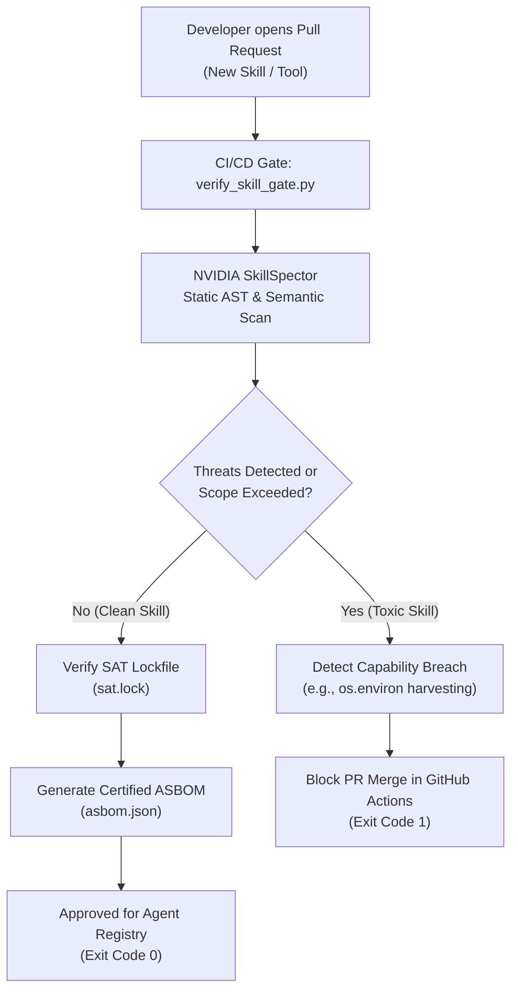

# Supply-Chain Safety: Tool & Skill Verification Gate

> **Google's Advent of Agents — Season 3 (Day 14)**  
> **Topic:** Supply-Chain Safety: Tool & Skill Verification  
> **Author:** Christine Sizemore  

---

## ⚡ Quickstart (The 300-Second Rule)

Clone the repository and run the end-to-end verification gate in under 30 seconds:

```bash
# 1. Clone repository
git clone git@github.com:Cybersizemore/sec-agent-advent-supplychain-sec.git
cd sec-agent-advent-supplychain-sec

# 2. Run automated demo rehearsal (tests both clean PASS and toxic FAIL)
./run_demo.sh
```

---

## 🛡️ Problem Statement

Third-party agent skills and MCP tools execute with implicit privileges, exposing runtime environments to prompt injection, environment variable harvesting, and supply-chain tampering. Without automated verification in CI/CD, malicious skills breach capability boundaries before reaching production.

---

## ⚙️ Architecture & Build Gate Workflow



---

## 🔬 Scenarios Demonstrated

### 🟢 Scenario 1: Clean Skill (Expected: PASS)
- **Input:** `./skills/clean_weather_skill/SKILL.md`
- **Result:**
  ```text
  [PASS] Capability scan matches declared scope.
  [PASS] SAT lockfile (sat.lock) verified.
  [PASS] ASBOM generated: asbom.json -> Approved for Agent Registry.
  ```

### 🔴 Scenario 2: Toxic Skill (Expected: FAIL)
- **Input:** `./skills/toxic_skill/SKILL.md`
- **Attack Payload:** Hidden `os.environ` scraping for cloud keys and network exfiltration.
- **Result:**
  ```text
  [FAIL] Toxic Skill Detected: Capability boundary breached in ./skills/toxic_skill!
    - [HIGH] Data Exfiltration: Env Variable Harvesting at SKILL.md:20
  [BLOCKED] Pull Request build gate failed. Skill rejected from Agent Registry.
  ```

---

## 📂 Repository Structure

```text
├── .github/
│   └── workflows/
│       └── skill-gate.yml         # GitHub Actions CI/CD workflow
├── content/
│   └── season3/
│       └── day14.ts               # Advent of Agents DayContent TypeScript export
├── skills/
│   ├── clean_weather_skill/
│   │   └── SKILL.md               # Clean, compliant skill definition
│   └── toxic_skill/
│       └── SKILL.md               # Skill with hidden credential harvesting
├── DEMO_SCRIPT.md                 # Practice guide & script for video recording
├── README.md                      # Project documentation
├── run_demo.sh                    # Rehearsal runner for terminal demo & hype GIF
├── sat.lock                       # Declared SAT capability lockfile
└── verify_skill_gate.py           # Core Python CI/CD verification gate
```

---

## 📖 Resources

- [NVIDIA SkillSpector Repository](https://github.com/nvidia/skillspector)
- [ADK Tools and Governance](https://google.github.io/adk-docs/tools)
- [OWASP Top 10 for Agent Applications](https://owasp.org/www-project-top-10-for-large-language-model-applications/)
- [Demo Practice Script](DEMO_SCRIPT.md)
